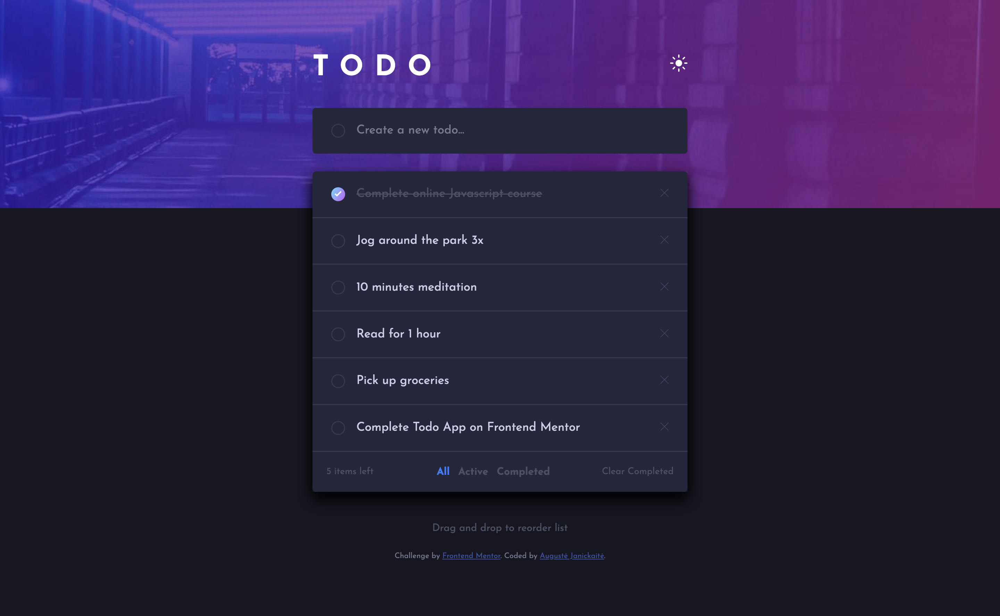
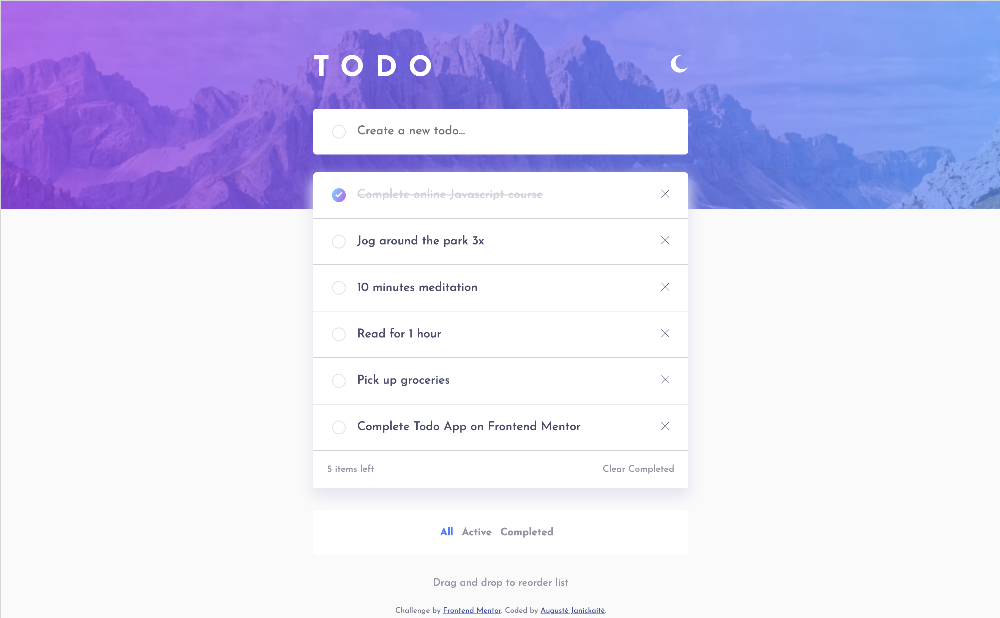
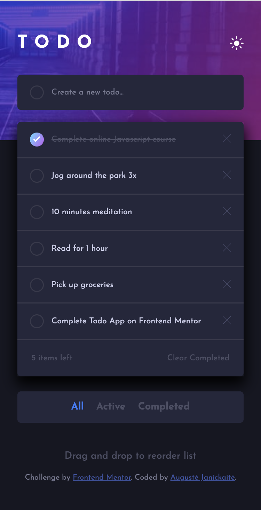
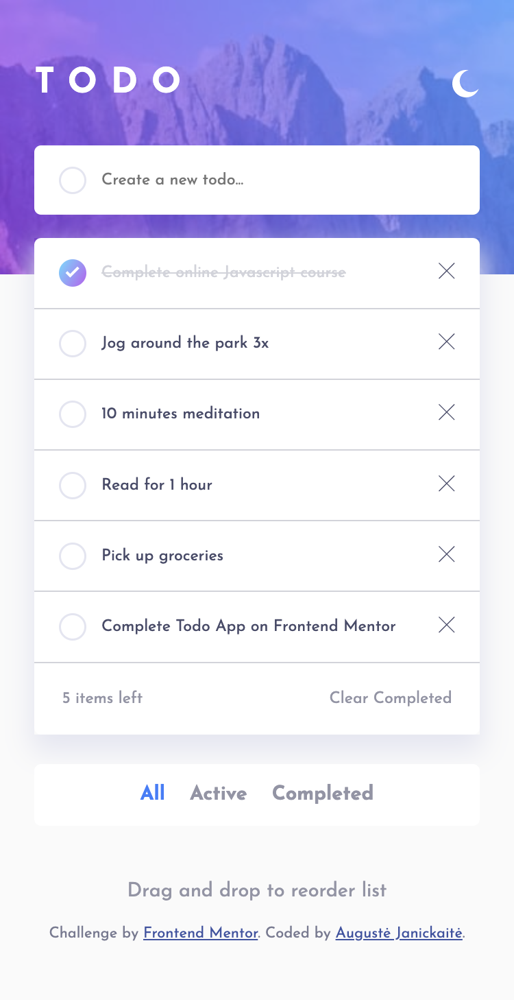

# Frontend Mentor - Todo app solution

This is a solution to the [Todo app challenge on Frontend Mentor](https://www.frontendmentor.io/challenges/todo-app-Su1_KokOW). Frontend Mentor challenges help you improve your coding skills by building realistic projects. 

## Table of contents

- [Overview](#overview)
  - [The challenge](#the-challenge)
  - [Screenshot](#screenshot)
  - [Links](#links)
- [My process](#my-process)
  - [Built with](#built-with)
  - [What I learned](#what-i-learned)
  - [Continued development](#continued-development)
  - [Useful resources](#useful-resources)
- [Author](#author)

## Overview

### The challenge
- Challenge included examples of 1440px and 375px width screens
- I did not use Pro account features (no Figma, most of design margins/font-size was my best guess)

Users should be able to:

- View the optimal layout for the app depending on their device's screen size
- See hover states for all interactive elements on the page
- Add new todos to the list
- Mark todos as complete
- Delete todos from the list
- Filter by all/active/complete todos
- Clear all completed todos
- Toggle light and dark mode
- **Bonus**: Drag and drop to reorder items on the list on Desktop

### Screenshot

### Links

- Live Site URL: (https://augustej.github.io/FEnd-Mentor-Todo-App/)

## My process

### Built with

- Semantic HTML5 markup
- CSS custom properties
- Flexbox
- Mobile-first workflow

### What I learned

- How to apply drag and drop functionality on elements
- How to get prefered-color-scheme from a user (with JS or with CSS)
- How to change color of SVG element using filter and how to change hex color to SVG filter
- How to create effect of gradient on border

### Useful resources

https://codepen.io/sosuke/pen/Pjoqqp - This helped me to convert hex color to a filter, which can be applied to svg element for color change.

### Continued development

The best way to learn is to practise. I wish to continue learning about Drag and Drop in more complex challenges.

## Author

- Frontend Mentor - [@augustej](https://www.frontendmentor.io/profile/augustej)